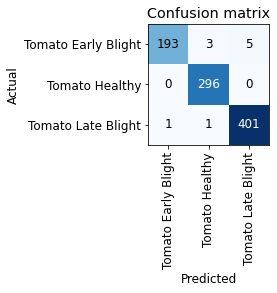

# NASA SpaceApps Hackathon

## Introduction

Our team (AgriCarer) is seeking to tackle the knowledge inequality problem currently faced by many farmers from developing countries. From our research and personal conversations with a local farmer in Malaysia, we found that most farmers in developing countries are smallholders farmers that generally lack access to best agriculture practices, data and information. Smallholders farmers do not have funding/investments necessary to procure state-of-the-art technologies and seek expert advice. Thus, local farmers are very vulnerable to the occurences of diseases and pest in ruining their entire crop and reducing their crop productivity. In some cases, the whole farm may have no yield as no proper actions are taken due to the lack of knowledge. This can lead to problems such as food insecurity, environmental issues and harm to the wellbeing of the farmers.

An example of the damage of food insecurity due to loss of crop is the Irish Potato famine of 1845-49 where an overdependence on a single crop with little genetic diversity set the stage for a devastating decline in yield that resulted in 1.2 million deaths out of a population of 9 million (WoodhamSmith 1991) <- find cite.

We are proposing an user friendly smartphone app to support farmers with state-of-the-art technologies and expert research advice to solve the problem of the knowledge gap and the problem of yield losses in crop plants. Most local farmers that we talked to does not have the necessary extra funds to invest in technology and they are also averse to new technology. Therefore, a smartphone app was suggested by the team as it will lower down the cost of entry for farmers as most farmers already owns a smartphone which makes the technology much easier to adopt.

The smartphone app proposed will have features such as remote sensing technology, plant disease diagnosis, and timely reminders. 

## Remote Sensing Technology 

The remote sensing technology will done by collecting free open-source satellite data from space agencies around the world such as NASA and ESA.

edgar + jiaren write more ...? put some maps, your findings.

## Plant Disease Diagnosis

This repository consist of a simple prototype/proof of an AI system that is able to classify different plant diseases. We used the FastAI API to train on our dataset. The dataset was obtained from PlantVillage.[PlantVillage](https://arxiv.org/abs/1511.08060)is an open-source dataset consisting of over 50,000 expertly curated images of healthy and infected leaves of crop plants. 

In this case of our proof, we decided to train on a subset of the PlantVillage dataset and took only three categories namely Tomato Healthy, Tomato Early Blight and Tomato Late Blight. Data used can be found [HERE](https://drive.google.com/drive/folders/1fLFJAc4h7pcL2QFuUs2R-R8-i32eg44L?usp=sharing), there is a total of 4500 raw images in it. Utilising a ResNet50 with data augmentation, we were already able to achieve  98.89% accuracy on the validation set consisting of 900 images (20% of 4500 raw images was used for validation) as seen of the confusion matrix below:

A example of the classification in action:

