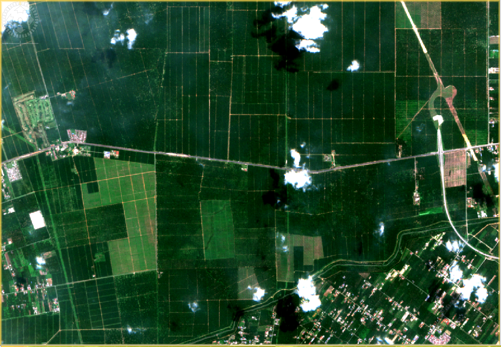
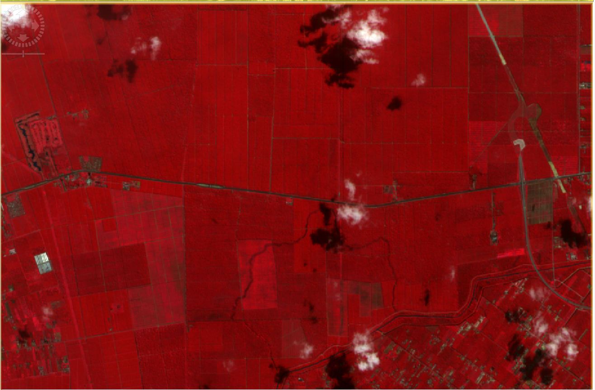
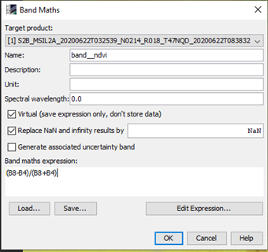
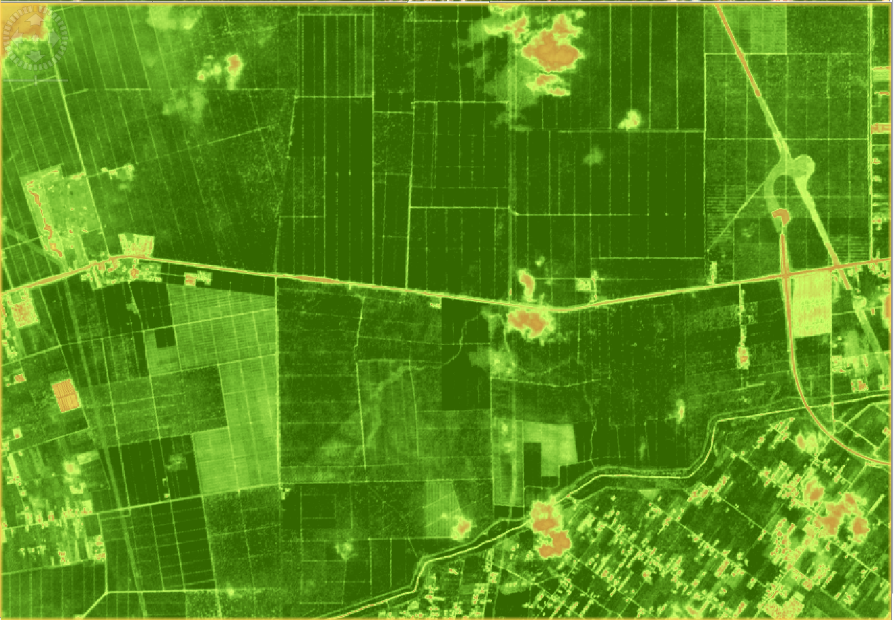

# NASA SpaceApps Hackathon (AgriCarer)

## Introduction

Our team (AgriCarer) is seeking to tackle the knowledge inequality problem currently faced by many farmers from developing countries. From our research and personal conversations with a local farmer in Malaysia, we found that most farmers in developing countries are smallholders farmers that generally lack access to best agriculture practices, data and information. Smallholders farmers do not have funding/investments necessary to procure state-of-the-art technologies and seek expert advice. Thus, local farmers are very vulnerable to the occurences of diseases and pest in ruining their entire crop and reducing their crop productivity. In some cases, the whole farm may have no yield as none of the proper actions were taken due to the lack of knowledge. This can lead to problems such as food insecurity, environmental issues and harm to the wellbeing of the farmers.

# Idea Proposal

We are proposing an user friendly smartphone app to support farmers with state-of-the-art technologies and expert research advice to solve the problem of the knowledge gap and the problem of yield losses in crop plants. Most local farmers that we talked to do not have the necessary extra funds to invest in technology and they are also averse to new technology. Therefore, a smartphone app was suggested by the team as it will lower the cost of entry for farmers as most farmers already own a smartphone, making the technology much easier to adopt for smallholders farmers that needs it the most.

The smartphone app proposed will have features such as remote sensing technology, plant disease diagnosis, and timely reminders to support farmers in taking care of their farms. 

## Remote Sensing Technology (Proof of concept done on a Malaysia Farm)

The remote sensing technology will done by collecting free open-source satellite data from space agencies around the world such as NASA, CSA, CNES, JAXA, and ESA.

The remote sensing functionality utilizes Multispectral Scanner System (MSS) sensors equipped
on satellites. MSS sensors have the ability to capture data at exceptional spatial resolution as
well as determine reflectance in near-infrared. Studies have shown that the electromagnetic
data collected by the MSS sensors can be utilised for crop monitoring using vegetation indices
(computed by using a combination of electromagnetic data captured).

Vegetation indices can be defined as the indicator that quantifies vegetation biomass and plant
vigor for each pixel in a remote sensing image which allows reliable spatial and temporal inter-
comparisons of terrestrial photosynthetic activity and canopy structural variations. A few
examples of vegetation indices which can be calculated from the data obtained from MSS
sensor on satellites are NDVI, MCARI, TCARI and PVI, all which are capable of relaying some
type of useful information about the farm while accurately indicating the affected area. (Reference: [1](https://worldwidescience.org/topicpages/m/multispectral+scanner+applications.html) [2](https://www.sciencedirect.com/topics/earth-and-planetary-sciences/multispectral-scanner))

Our validation step involves obtaining open data multispectral imagery captured by satellite
MSS sensors and processing these images to derive the NDVI index for an area of farmland.
The image data extraction and processing are aided by functionalities and software readily
available by the European Space Agency (ESA).
We source our data directly from the [Copernicus Open Access Hub](https://scihub.copernicus.eu/dhus) 
which provides free and open access to imagery captured
by the Sentinel satellites launched during the Copernicus program during 2014 to 2015. The
Open Access hub allows us to specify to exact regions of interest, satellite sensing periods, and
selection of Sentinel imagery required.
We then utilise ESA’s Sentinel Application Platform (SNAP) program, which allows combination
of several multispectral data to display satellite images. 

The common types of images are RGB (Red, Green, Blue) and Infrared as show below (we extracted images of a farm in Bukit Rotan,Kuala Selangor,Malaysia) to show a proof of concept:

RGB:

Infrared:

As a proof of concept, our team derived one common vegetation index, Normalized Difference Vegetation Index (NDVI) using the software SNAP to customise combination of light bands to derive useful mapping presentation. In this case, we derive the NDVI mapping by considering the formula above, with NIR and Red represented by bands B8 and B4.

Example of NDVI images that was preprocessed:

NDVI, which measures the amount of green vegetation in an area. NDVI is based on the principle that actively growing green plants strongly absorb radiation in the visible region of the spectrum (the “PAR,” or “photosynthetically active radiation”), while strongly reflecting radiation
in the near-infrared (NIR) region. A healthy plant with lots of chlorophyll. NDVI is a standardized
way to measure healthy vegetation. When you have high NDVI values, you have healthier
vegetation. When you have low NDVI, you have less or no vegetation and good cell structure
will actively absorb red light and reflect near infrared. [Reference](https://www.researchgate.net/publication/334547726_Application_of_normalized_difference_vegetation_index_NDVI_to_forecast_rodent_population_abundance_in_smallholder_agro-ecosystems_in_semi-arid_areas_in_Tanzania)

In our instance above, we defined our spectrum of low NDVI (represented by yellow) and high
NDVI (green). Greener regions, i.e towards the end of the spectrum suggests healthier
vegetation and yellowish regions suggest the contrary.

Thus, we can integrate these open-source satelitte imagery to our smartphone app and provide the technology to smallholder farmers to improve the crop production of their farms.

## Plant Disease Diagnosis

This repository consist of a simple prototype/proof of an AI system that is able to classify different plant diseases. We used the FastAI API to train on our dataset. The dataset was obtained from PlantVillage. [PlantVillage](https://arxiv.org/abs/1511.08060) is an open-source dataset consisting of over 50,000 expertly curated images of healthy and infected leaves of crop plants. 

In this case of our proof, we decided to train on a subset of the PlantVillage dataset and took only three categories namely Tomato Healthy, Tomato Early Blight and Tomato Late Blight. Data used can be found [HERE](https://drive.google.com/drive/folders/1fLFJAc4h7pcL2QFuUs2R-R8-i32eg44L?usp=sharing), there is a total of 4500 raw images in it. Utilising a ResNet50 with data augmentation, we were already able to achieve  98.89% accuracy on the validation set consisting of 900 images (20% of 4500 raw images was used for validation) as seen of the confusion matrix below:

  

However, it is worth noting that the model trained on PlantVillage data does not transfer well to the real-domain which is of expectation as the AI system is trained using supervised learning. Supervised learning depends heavily on the quantity, quality and diversity of the datasets to perform well. The PlantVillage database is taken under controlled lab conditions with a single leaf in the photo as shown below. 

  

Thus, when a plant is taken as a whole, the AI will most probably fail to classify correctly as the AI is overfitting the images taken under controlled lab conditions.  An example of misclassification, a healthy tomato plant is classified as late blight:

  

Our team is well aware of the problem of misclassification which is why we believe that this making an app that is widely available and accessible is a great idea for mass data collection in order to train a more robust AI model. We believe that by pre-processing images taken by the farmer and allowing farmers to pick out leaves of interest for diagnosis (classification) will ensure great AI classification results that farmers can confidently trust in. The most important principle for success is a sound standardized imaging procedure that yields repeatable results. Our team also believes that the classifier can be extended to classify pests to support farmers.

An illustration of our app prototype after the classifying process:

Put a gif from the app (flows from camera -> diagnosis)

We will approach plant pathologist and researchers to seek out expert advice on what kind of immediate actions are required, general advices and preventative measures for the specific disease detected. These informations can then be immediately disseminated to the farmers right after the plant is classified through the app. Thus, the app can greatly support farmers in identifying diseases and recommend the best course of actions. We believe that this will increase the crop yield of local farmers and bridge the gap between farmers and researchers.

